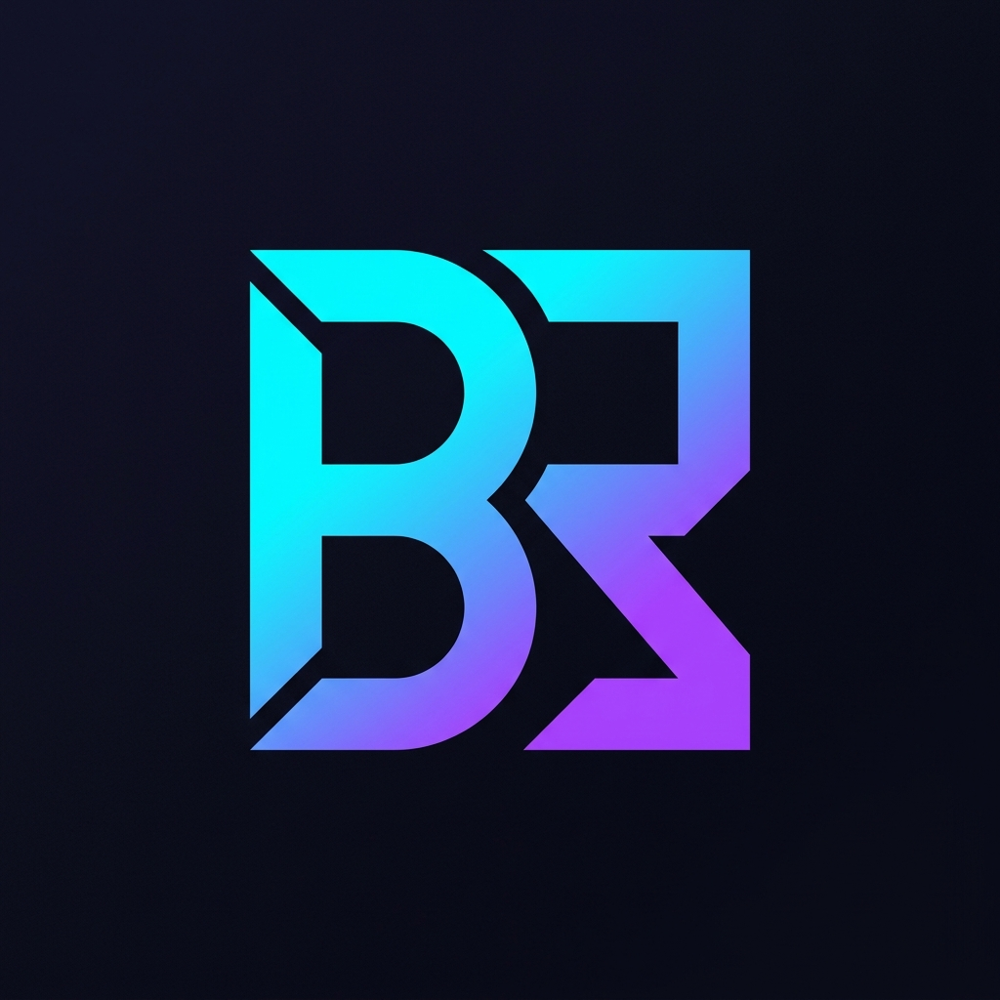

# 🚀 3D Animated Portfolio | BARATHRAJI P

A high-performance, immersive, and glassmorphic personal portfolio built with **React.js**, **Three.js**, and **GSAP**. This portfolio features a dynamic 3D particle background, interactive wireframe shapes, and smooth scroll animations.

 <!-- Update with a real screenshot if available -->

## ✨ Features

- **🌐 3D Immersive Background:** Interactive particle system and floating wireframe geometries using **Three.js**.
- **✨ Glassmorphic UI:** Modern design aesthetics with backdrop blurs, subtle borders, and glow effects.
- **📜 Smooth Animations:** Advanced scroll-triggered entrance animations and transitions via **GSAP**.
- **📱 Fully Responsive:** Optimized for all devices from mobile to large desktop screens.
- **🎨 Interactive Profile:** Innovative circular profile frame with rotating rings and hover effects.
- **📂 Component-Based:** Clean, modular React architecture for easy maintenance and scaling.

## 🛠️ Tech Stack

- **Framework:** [React 19](https://react.dev/)
- **Build Tool:** [Vite](https://vite.dev/)
- **3D Graphics:** [Three.js](https://threejs.org/)
- **Animations:** [GSAP (GreenSock)](https://greensock.com/)
- **Icons:** [Lucide React](https://lucide.dev/)
- **Styling:** CSS3 (Vanilla + Custom Properties)

## 🚀 Getting Started

### Prerequisites
- [Node.js](https://nodejs.org/) (v18 or higher recommended)
- [npm](https://www.npmjs.com/)

### Installation
1. Clone the repository:
   ```bash
   git clone https://github.com/YOUR_USERNAME/portfolio-react.git
   ```
2. Navigate to the project directory:
   ```bash
   cd portfolio-react
   ```
3. Install dependencies:
   ```bash
   npm install
   ```

### Running Locally
To start the development server:
```bash
npm run dev
```
Open **http://localhost:5173** in your browser to view the site.

### Building for Production
To create an optimized production build:
```bash
npm run build
```
The output will be in the `dist/` folder.

## 📬 Contact

- **Name:** Barathraji P
- **LinkedIn:** [barathraji](https://www.linkedin.com/in/barathraji)
- **Email:** barathraji2004@gmail.com
- **Phone:** +91 87603 06705

---


go to test  **cyberbarathportfolio.netlify.app**


*Built with ❤️ by Barathraji P*
